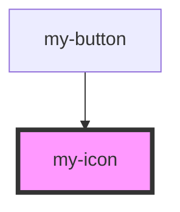

# my-icon

<!-- Auto Generated Below -->

## Properties

| Property | Attribute | Description    | Type     | Default             |
| -------- | --------- | -------------- | -------- | ------------------- |
| `name`   | `name`    | The first name | `string` | `"arrow-right.svg"` |

## Dependencies

### Used by

 - [my-button](../my-button)

### Graph

----------------------------------------------

*Built with [StencilJS](https://stenciljs.com/)*
